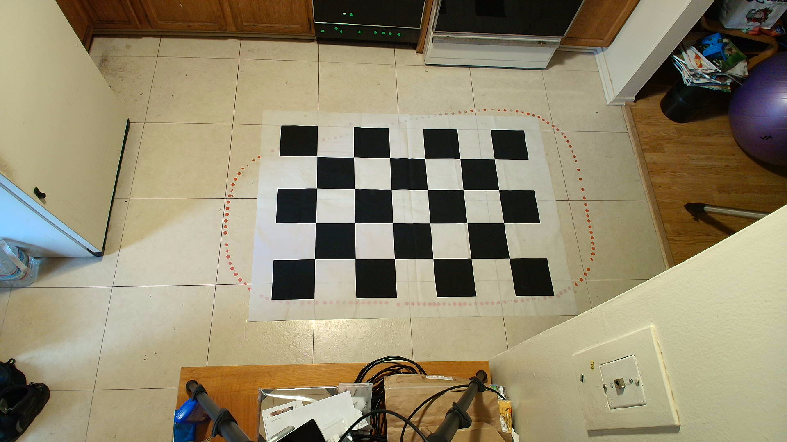

# ips_cam [](https://github.com/StuartGJohnson/ips_cam/actions/workflows/build_test.yml)

## An Indoor Positioning System based on V4L2 USB Cameras

This package is a modification, extension and mutation of the ROS2 usb_cam package. Given offline calibration and other setup (see below), `ips_cam` tracks multiple targets in the camera FOV which are adorned with ARUCO markers. It is assumed these markers physically lie parallel to a single plane (i.e., the floor), and are offset by a known, tag-specific height. An example is one or more robots (of possibly different heights) moving on the floor, each bearing a visible ARUCO tag at a fixed and known height - parallel to the floor at all times. `ips_cam` streams the orientation and position of each tag (as a ROS PoseStamped topic). Much like GPS, IPS (or perhaps better LPS!) is intended to be a ubiquitous position service - the IPS camera should be observing the robot work area and this ROS2 node should be running on dedicated IPS hardware - not (directly) as part of a robot or its perception stack.

Unlike `usb_cam`, it is not the intention of `ips_cam` to act as a publisher of camera frames. It is possible that some future diagnostic functions might end up providing frames (or a few images) in some way. Two primary design principles of `ips_cam` are:

* maximize frame rate
* maximize image quality/resolution for ARUCO tag pose determination

In order to address these concerns, `ips_cam` is designed to process the image stream at high resolution and frame rate at the edge. To this end, V4L2 buffering is used to provide high resolution images. Each high resolution image buffer element is converted/copied to monochrome via OPENCV. The buffer element is then returned to the V4L2 circular buffer. Detection and localization of ARUCO tags then occurs via OPENCV on each monochrome frame, and tag poses are published to the ROS2 network. This means no transport of large images occurs over the ROS2 network - the image stream only needs to make it to the edge compute resource running `ips_cam`.

## Algorithm

`ips_cam` has 3 principle internal functions:
* Establishing of Indoor Coordinate System (ICS)
* (streaming) ARUCO tag detection and localization in the image
* (streaming) tag pose estimation in the ICS.

ARUCO tag detection is entirely accomplished by calls to OPENCV. This involves detecting the (ordered) corners of tags in the image. This is done in such a way that the orientation of the tag can also be determined. In order to get the final tag orientation, the corners of the image are converted to the ICS and fit via a rigid scale/rotation transform via least-squares. In this way we apply our constraints that each tag lies in a plane parallel to the floor at a fixed height.

Conversion of image coordinates to the ICS deserves some elaboration. I refer to the following pdf document produced in latex/TexStudio (this makes the equations much easier to produce).

<todo: ICS math>


## Tested ROS 2 Distros and Platforms

This package has been tested - i.e. the unit and functional tests run - on a range of recent ROS2 distros (see the build and test actions / CI). Note, however, that V4L2 support for any given camera is likely problematic - due to the fact that cameras do not necessarily support the same control parameters in the same way. `ips_cam` has been developed with several cameras. Development began with the Microsoft LifeCam Studio, but was refined and adapted for use with the Logitech C920 and the Logitech MX Brio - primarily for higher image resolution. It is likely that other cameras support for specific camera controls and image formats varies, so it should not be expected that any camera will work out of the box. It might be hoped, however! It should generally not be too difficult to fork this code, do some camera spelunking with `v4l2-ctl` (see below), and update the code to support your camera in detail.

Windows and Mac platforms have not been tested against or even attempted. Presumably the biggest hurdle would be the platform-specific replacement for V4L2 for these platforms. The package was developed on an x86-64 platform and a Raspberry Pi 4, both running Ubuntu 22.04 and ROS2 Humble.

## Building from Source

Clone/Download the source code into your workspace:

```shell
cd /path/to/colcon_ws/src
git clone https://github.com/StuartGJohnson/ips_cam.git
```

Once downloaded and ensuring you have sourced your ROS 2 underlay, e.g.:

```shell
source /opt/ros/humble/setup.bash
```

go ahead and install the dependencies:

```shell
cd /path/to/colcon_ws
rosdep install --from-paths src --ignore-src -y
```

From there you should have all the necessary dependencies installed to compile the `ips_cam` package:

```shell
cd /path/to/colcon_ws
colcon build
source /path/to/colcon_ws/install/setup.bash
```

Be sure to source the newly built packages after a successful build.

Once sourced, you should be able to run the package as shown below.

I worked on development with VSCode on linux. While getting VSCode to function adequately takes some time for a given project, once the proper .vscode files are set up and extensions installed and adjusted, the experience of coding and testing is probably worth all the effort - depending on how much work there is to be done recoding. I made use of the following extensions:

* C/C++
* C/C++ Extension Pack
* C/C++ Themes
* C++ TestMate
* CMake Tools
* OpenCV C++ Image
* ROS
* ROS2

Note there are numerous semi-mysterious steps in getting VSCode to wake up to your codebase. A parent repo (with a ros workspace) which was used to develop this package will be made public on github and linked here. That repo contains a .vscode directory with many useful tidbits.

## Configuration

`ips_cam_node` requires a collection of parameters to run. These settings are all defined in yaml files, and two image files are also required. The example below is taken from a working example in my kitchen using the Logitech MX brio. Unit and functional tests in the `ips_cam` repo include an earlier example developed with the MS LifeCam Studio.

In any of the configuration files, `ips_cam_node` comprehends two special path prefixes. This applies to all settings which resolve to file paths. Acceptable prefixes are:

* `~` : your home directory
* `$PKG` : the package build directory. This is used in testing.

In the examples below, it is assumed that all the files lie in a directory in your home directory called `~/IndoorPositioningSystem/ips_config_brio`. Currently these files are present in the `Config` directory of this package (in `ips_config_brio`).

## ```node_params.yaml``

`ips_cam_node` has numerous ROS parameters. These will default to values set in the class constructor/init code. Needless to say, all these defaults are probably wrong! An example `node_params.yaml` file is:

```yml
/**:
    ros__parameters:
      video_device: "/dev/video0"
      framerate: 30.0
      io_method: "mmap"
      frame_id: "camera"
      pixel_format: "yuyv"
      image_width: 1920
      image_height: 1080
      camera_name: "test_camera"
      ics_params_file: "~/IndoorPositioningSystem/ips_config_brio/ics_params.yml"
      tracking_params_file: "~/IndoorPositioningSystem/ips_config_brio/tracking.yml"
      autofocus: false
      focus: 36
      auto_white_balance: false
      white_balance: 4000
      autoexposure: true
      exposure: 300
```

This file defines camera device settings and the `ips_cam_node` node parameters. It also defines the paths for the files below. Note that focus is fixed - this causes a stable camera calibration. Surprisingly, this logitech camera - on the raspberry pi 4 - provides a higher framerate when set to autoexposure. `auto_white_balance` can also effect frame rate, as can `backlight_compensation`. `backlight_compensation` appears to result in a better image quality. This v4l2 control needs to be added to `ips_cam_node`. Thus far, I have set it via:

```shell
v4l2-ctl --set-ctrl=backlight_compensation=1
```

## ```ics_params.yml```

This file defines everything needed to interpret the coordinate system chessboard - I use an enormous fabric pattern I found online, which I place on the floor for calibration and the definition of the world coordinate system - also known as the ICS (Indoor Coordinate System). During robot operations, I stash the pattern somewhere else. And take care not to bump the camera!

```yml
%YAML:1.0
---
intrinsics_file : "~/IndoorPositioningSystem/ips_config_brio/camera_intrinsics.yml"
checkerboard_image_file : "~/IndoorPositioningSystem/ips_config_brio/im_ref.png"
origin_image_file : "~/IndoorPositioningSystem/ips_config_brio/im_ref_aruco.png"
cbExtentX: 6
cbExtentY: 4
cbBlockSize: 198.0
origin_tag: 1
origin_tag_z: 0.0
```

In this case, the pattern block size is 198mm and the chessboard is 6x4 (internal corners). In order to define the origin, I take an image with an ARUCO tag placed at the origin, in this case tag #1 of `DICT_5x5_50` (this needs to be exposed as a node parameter). The YAML file format here is chosen to be friendly with OPENCV's yaml file reader.

The image of the chessboard pattern for the determination of the ICS is:



Since there are two possible coordinate systems (origin at upper right or lower left), `ips_cam` requires another image with the tag of choice at `(0,0)`. Thus:


So that X in the ICS is roughly left to right in the image, and Y is from bottom to top. Pose topics are reported in mm using the configuration files included here.

## ```camera_intrinsics.yml```

This file is the output of offline calibration. I have been using MATLAB's camera calibration app - which is fairly interactive (although glitchy). An additional bit of code is required to translate the matlab calibration to OPENCV-friendly data. The YAML file format here is chosen to be friendly with OPENCV's yaml file reader.

```yml
%YAML:1.0
---
camera_matrix: !!opencv-matrix
   rows: 3
   cols: 3
   dt: d
   data: [1126.43502267332, 0, 956.938294322799, 0, 1135.75041995548, 582.392914614646, 0, 0, 1]
dist_coeffs: !!opencv-matrix
   rows: 1
   cols: 5
   dt: d
   data: [0.128339234956909, -0.19722106638232, 0, 0, 0]
image_height: 1080
image_width: 1920
```

Currently distortion is not corrected for in `ips_cam_node` processing. This will be investigated/addressed as more testing of `ips_cam` position data is implemented. The YAML file format here is chosen to be friendly with OPENCV's yaml file reader.

## ```tracking.yml```

This file defines the ARUCO tags to track:

```yml
%YAML:1.0
---
tag : [1, 3, 2]
tag_z : [5.0, 126.0, 5.0]
```

In this example, I am tracking tags #1 and #2 on 5mm foam-core cards, and #3 tag mounted on a differential drive robot - which happens to be 126mm above the floor. The PoseStamped topics corresponding to these objects will be published to `/object_1`, `/object_2` and `/object_3`. The YAML file format here is chosen to be friendly with OPENCV's yaml file reader.

## Running

After defining the configurations in the previous section, running the node is straightforward.

```shell
ros2 run ips_cam ips_cam_node_exe --ros-args --params-file <node_params.yaml>
```

where ```<node_params.yaml>``` resolves to the path of the file described above. 

## Supported formats

### Device supported formats

To see a connected device's supported formats, run the `ips_cam_node` and observe the console output.

An example output is:

```log

This device supports the following formats:
        YUYV 4:2:2 640 x 480 (60 Hz)
        YUYV 4:2:2 640 x 480 (30 Hz)
        YUYV 4:2:2 640 x 480 (24 Hz)
        YUYV 4:2:2 640 x 480 (20 Hz)
        YUYV 4:2:2 640 x 480 (15 Hz)
        YUYV 4:2:2 640 x 480 (10 Hz)
        YUYV 4:2:2 640 x 480 (7 Hz)
        YUYV 4:2:2 640 x 480 (5 Hz)
        YUYV 4:2:2 160 x 120 (60 Hz)
        YUYV 4:2:2 160 x 120 (30 Hz)
        .
        .
        .
```

Other helpful commands for grokking your camera are:

```shell
v4l2-ctl -l
```

and

```shell
v4l2-ctl -V
```

All of these tools are paths to discovering or implementing support for a given camera/format/controls.

### Supported IO methods

The original internal `usb_cam` driver supports three different IO methods:

1. `read`: copies the video frame between user and kernel space
2. `mmap`: memory mapped buffers allocated in kernel space
3. `userptr`: memory buffers allocated in the user space

`ips_cam` has only been tested using `mmap`.

To read more on the different methods, check out [this article that provides a good overview
of each](https://lwn.net/Articles/240667/). Also see the original `usb_cam` ROS2 package.

## Image Compression

Currently `ips_cam` does not support processing a compressed image stream, nor in fact does it support any format other than YUYV. This is determined by the

```code
 IpsCamNode::take_and_process_image()
 ```

method. This method needs to know 2 things about the frame stream: the OPENCV pixel type (e.g., `CV_8UC2`) and how to convert the (color) frame to monochrome. Lower bandwidth (e.g. USB2) cameras typically support high resolution images via MJPEG encoding. We will need to add code to support this stream type (via configuration) and uncompress each image via OPENCV's `imdecode()`. The down side of (M)JPEG is lossy compression.

## Address and leak sanitizing

Incorporated into the `CMakelists.txt` file to assist with memory leak and address sanitizing
is a flag to add these compile commands to the targets.

To enable them, pass in the `SANITIZE=1` flag:

```shell
colcon build --packages-select ips_cam --cmake-args -DSANITIZE=1
```

Once built, run the nodes executable directly and pass any `ASAN_OPTIONS` that are needed:

```shell
ASAN_OPTIONS=new_delete_type_mismatch=0 ./install/ips_cam/lib/ips_cam/ips_cam_node_exe <params>
```

After shutting down the executable with `Ctrl+C`, the sanitizer will report any memory leaks.

By default this is turned off since compiling with the sanitizer turned on causes bloat and slows
down performance.

## Documentation

Documentation (e.g. Doxygen) support/generation is a pending project.

### License

`ips_cam` is released with a BSD license. For full terms and conditions, see the [LICENSE](LICENSE) file.

### Authors

See the [AUTHORS](AUTHORS.md) file for a full list of contributors.
